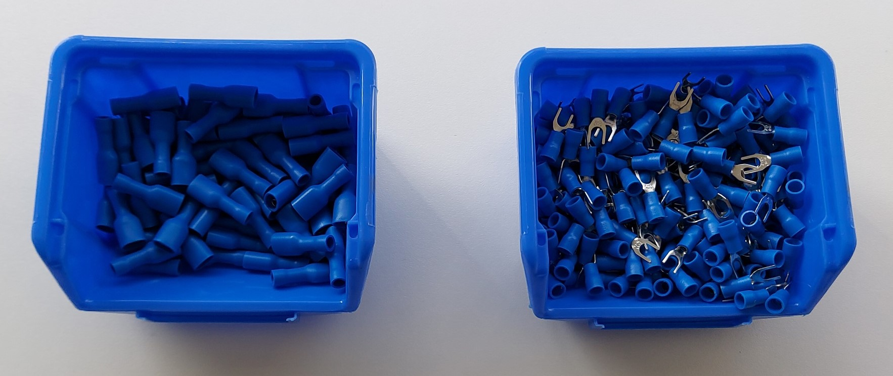
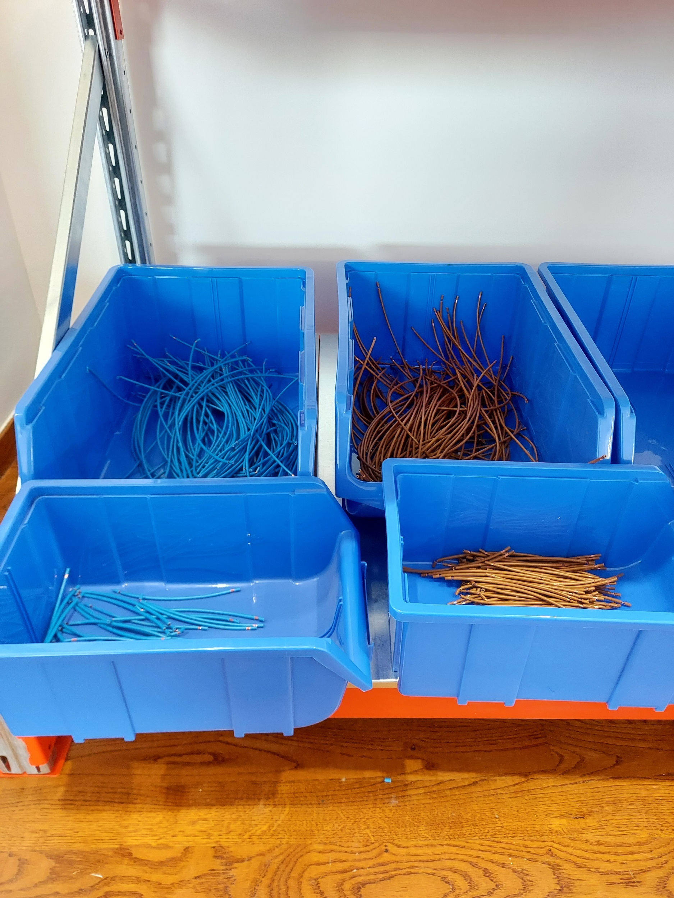
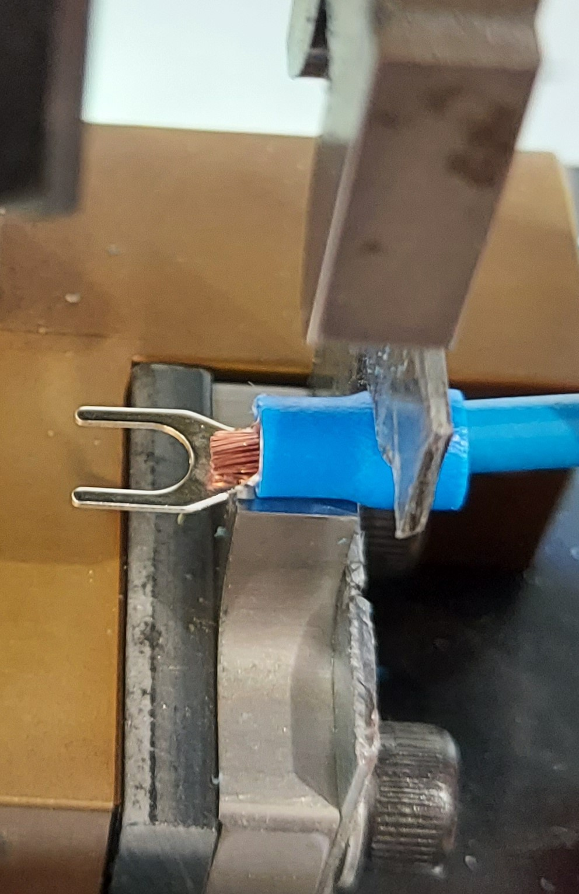
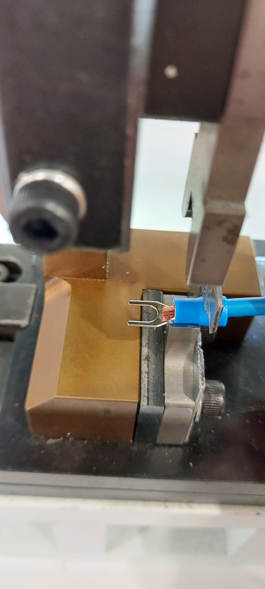
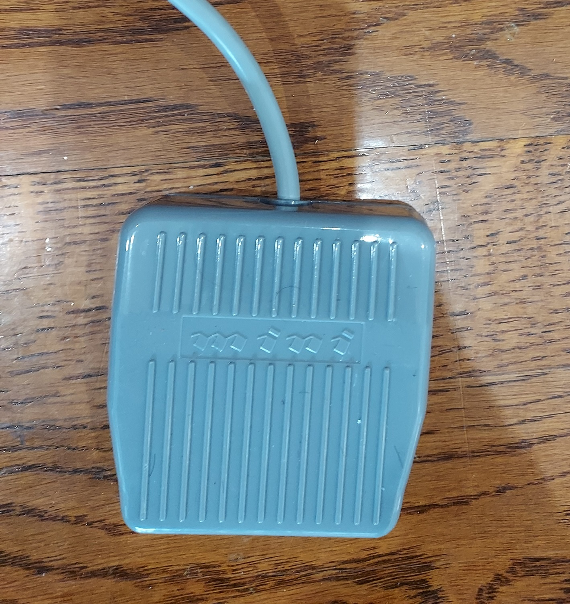
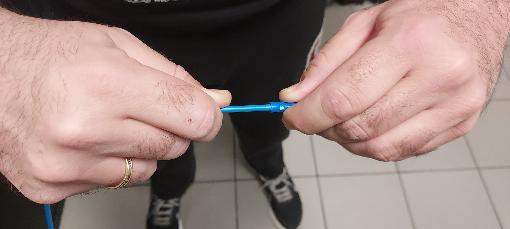
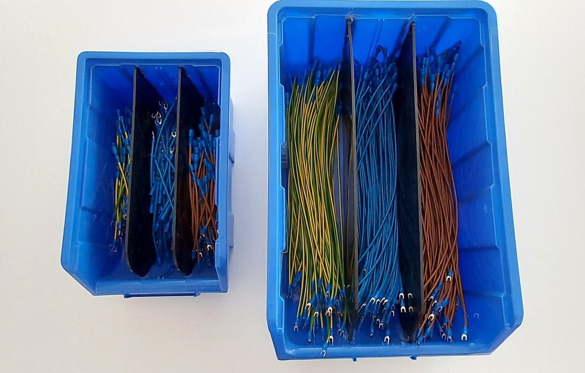
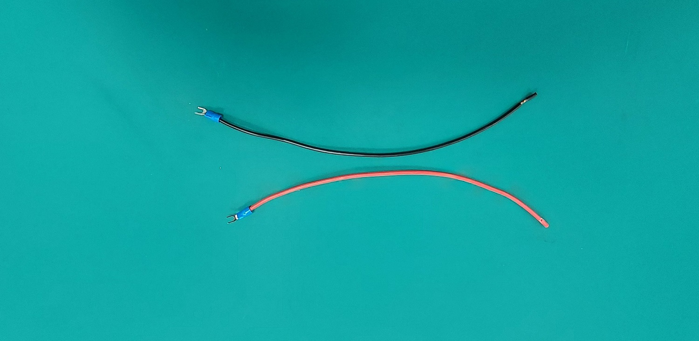
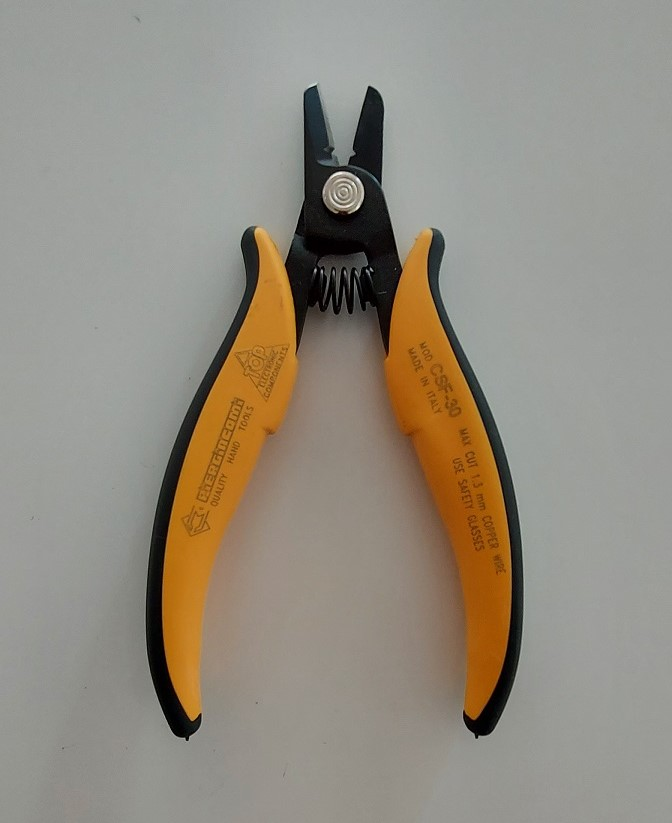
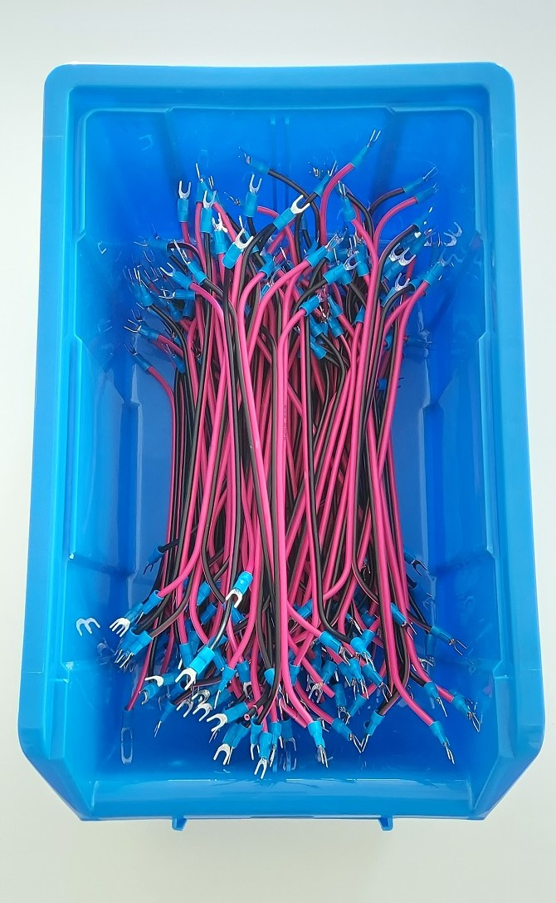

 

# Cable crimping
EtcherPro v1

### Contents
TBC-

## Step 1. Crimp Fork-terminal to the AC cables

- Fill the 2 small boxes with Fork and quick terminals

- Place boxes with the terminals at your left-hand side

- Place box with the AC cables at your right-hand side

- Take a 40 or 14cm cable at your hand and remove the -protecting cap with trimmed insulation

- Take 1 Fork-terminal at your left hand and place it to the bare 7mm copper strings all the way in. IMPORTANT: The copper wire should protrude from the terminal’s insulation about 2mm, like in the picture below If that is not the case, make sure you are using the 7mm end and the cable is properly inserted into the terminal.

- Align the cable with the terminal to the crimper and make sure that it’s in the right place

- Push the pedal with your foot to crimp after you make SURE that your left hand(after you have aligned the fork terminal) is away from the crimper.

- Complete the batch and proceed to the quick-terminal crimping

## Step 2. Crimp the quick-terminal to the AC cables

- Take the crimped Fork-terminal cables batch and place it on your right-hand side again

- Take one quick terminal from the boxes you have on your left-hand side

- Remove the protecting cap and place the terminal into the bare 9mm copper all the way in

- Align the cable with the terminal to the crimper and make sure that it’s in the right place

- Push the pedal with your foot to crimp after you make SURE that your left hand(after you have aligned the fork terminal) is away from the crimper

- Make sure that the quick terminal is well pressured by holding the cable’s edge and the terminal and stretch both sides. Proceed to the next one.

- Complete the batch and place it in its storage box

## Step 3. Crimp Fork-terminals to the DC cables

- Without removing the protection caps make a small cut to the 2 edges with the long-edged cutter be extra careful NOT TO HEART THE MAIN’S BODY INSULATION, if you do that discard the cable and make another one

- After cutting the 2 edges split the cable for 3-4cm long
- Remove the protecting caps and repeat the Step 1 crimping process for the 4 edges
- After completing the batch place them in the storage box

