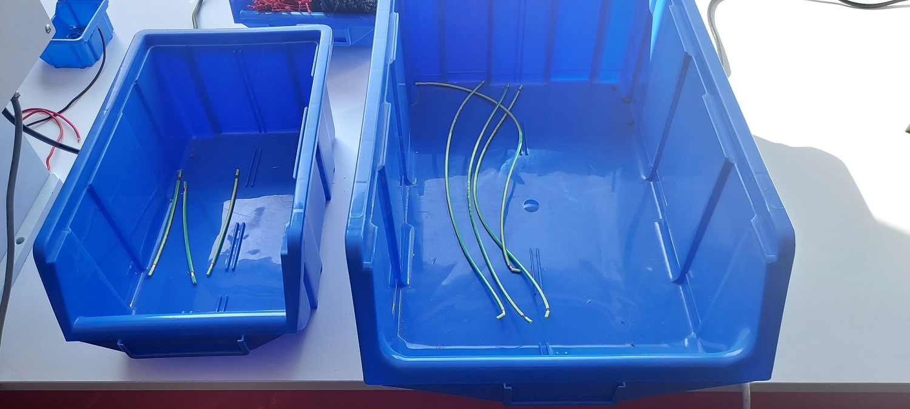
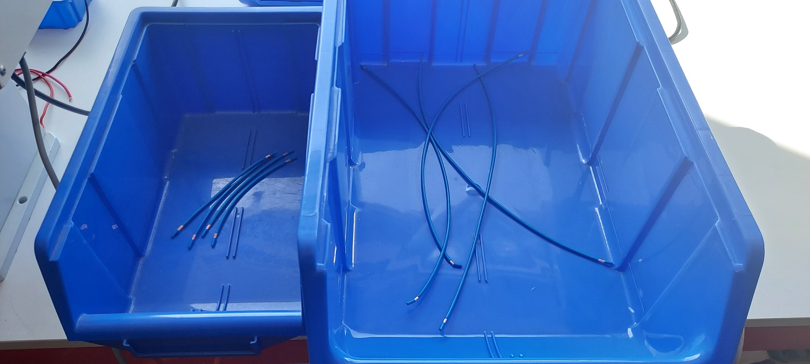
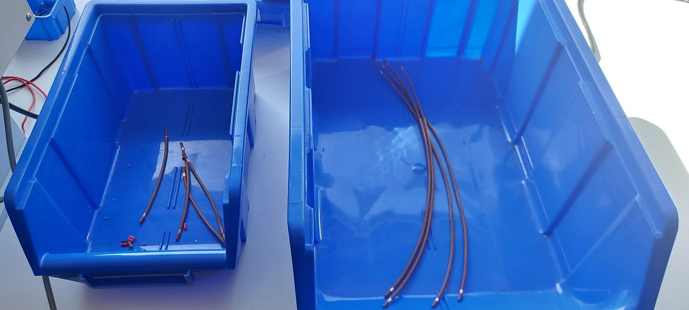
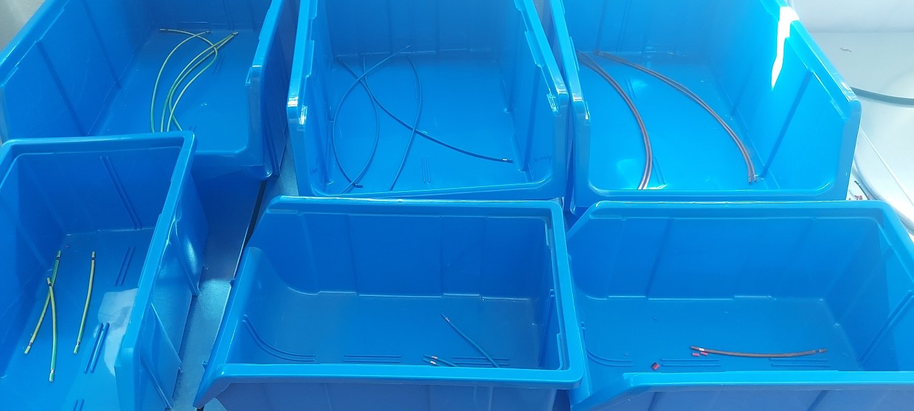
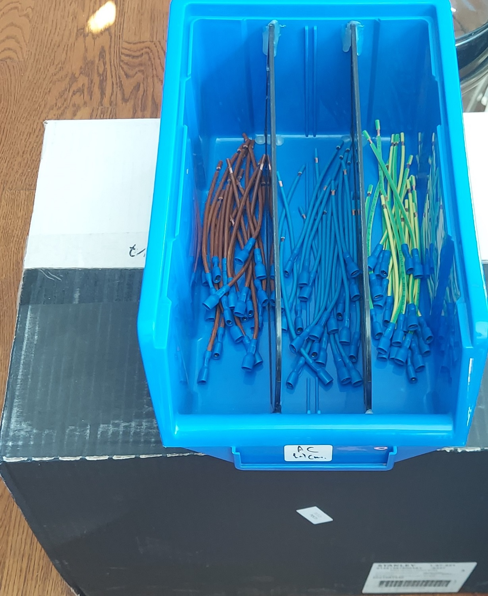
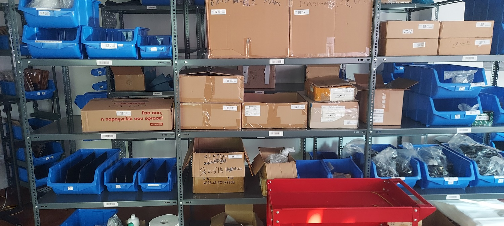
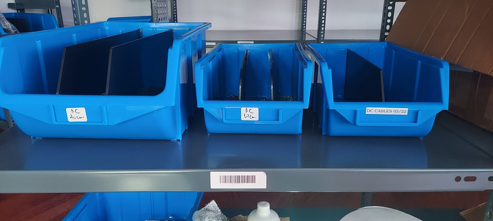

 

# Assembly Batch production
EtcherPro [v1.1.3](https://github.com/balena-io-hardware/etcherPro/tree/v1.1.3)

## Contents

- [EtcherPro ready to ship](#EtcherPro-ready-to-ship)
  - [EtcherPro packed](#EtcherPro-packed)
    - [Cable bag subassembly](#Cable-bag-subassembly)
    - [EtcherPro in bag](#EtcherPro-in-bag)
      - [EtcherPro device](#EtcherPro-device)
        - [Top subassembly](#Top-subassembly)
          - [Top shell complete](#Top-shell-complete)
            - [Top shell with UV resin](#Top-shell-with-UV-resin)
            - [Fan blower complete](#Fan-blower-complete)
            - [Magnets complete](#Magnets-complete)
          - [PCBA complete](#PCBA-complete)
            - [CM subassembly](#CM-subassembly)
            - [DC harness](#DC-harness)
        - [Bottom subassembly](#Bottom-subassembly)
          - [PSU complete](#PSU-complete)
            - [AC harness](#AC-harness)

## AC harness

[BoM](https://github.com/balena-io-hardware/etcherPro-assemblyGuide#ac-harness)

#### Steps

1. Cut as many 14cm cables (yellow, blue, brown) as specified in the production-manufacturing order by
selecting program 1 on the cable-cutting-stripping machine and put it in the small blue box as shown in the photo.
2. Cut as many 40cm cables (yellow, blue, brown) as specified in the production-manufacturing order by
selecting program 2 on the cable-cutting-stripping machine put it in the large blue box as shown in the photo.

| Wires | Image |
|-|-|
| Yellow AC wires |  |
| Blue AC wires |  |
| Brown AC wires |  |

* [AC-DC wire-cutting-stripping instructions](https://github.com/balena-io-hardware/etcherPro-assemblyGuide/blob/master/output/Sub-processes/AC-DC-wire-cutting-stripping.md)
3. Keep the box containing the short wire of one color of wires on the workbench where the crimping machine is,
to your right, and store the remaining boxes underneath the bench, as indicated in the photo.

4. Place the production AC-wire small box in your left side as shown in the photo.

5. Bring the small box with the quick terminals to the crimping machine's left side.

6. Begin crimping, after that place its colour of the wire to its place as shown in the photo.
Follow instructions [here](https://github.com/balena-io-hardware/etcherPro-assemblyGuide/blob/master/output/Sub-processes/Cable-crimping.md)
7. Repeat the process also for the other colour of the short wires.
8. Place the short wires in the designated location on the production shelf once you have completed using all the colors.
Do not move them unless there is a cause to do so and the distribution team is informed of it. The assembly warehouse has a wayfinding map
in the inventory software system.

9. Repeat the process for the long wires as well.
