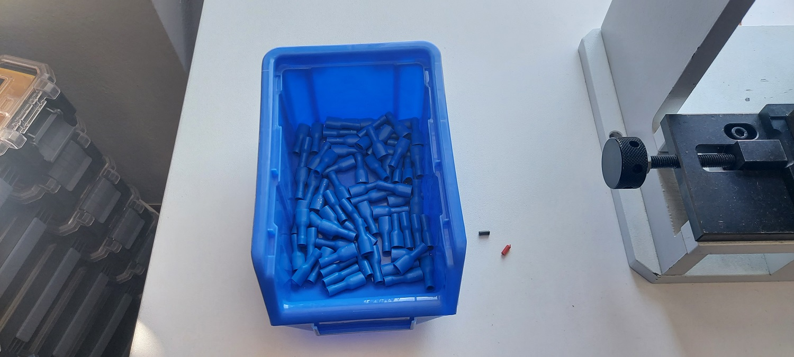
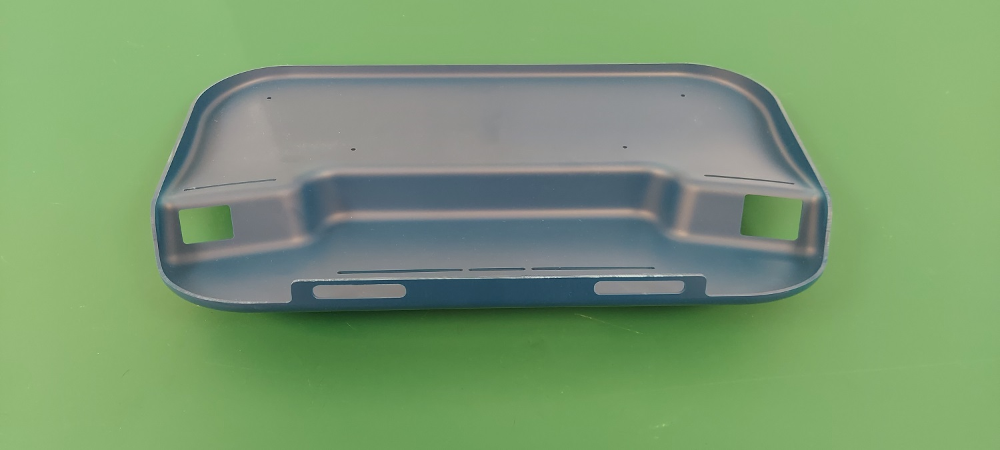

 

# Assembly Batch production
EtcherPro [v1.1.3](https://github.com/balena-io-hardware/etcherPro/tree/v1.1.3)

## Contents

- [EtcherPro ready to ship](#EtcherPro-ready-to-ship)
  - [EtcherPro packed](#EtcherPro-packed)
    - [Cable bag subassembly](#Cable-bag-subassembly)
    - [EtcherPro in bag](#EtcherPro-in-bag)
      - [EtcherPro device](#EtcherPro-device)
        - [Top subassembly](#Top-subassembly)
          - [Top shell complete](#Top-shell-complete)
            - [Top shell with UV resin](#Top-shell-with-UV-resin)
            - [Fan blower complete](#Fan-blower-complete)
            - [Magnets complete](#Magnets-complete)
          - [PCBA complete](#PCBA-complete)
            - [CM subassembly](#CM-subassembly)
            - [DC harness](#DC-harness)
        - [Bottom subassembly](#Bottom-subassembly)
          - [PSU complete](#PSU-complete)
            - [AC harness](#AC-harness)

## AC harness

Find the [BoM](https://github.com/balena-io-hardware/etcherPro-assemblyGuide#ac-harness) on the assembly guide.

#### Steps

1. Cut as many 14cm cables (yellow, blue, brown) as specified in the production-manufacturing order by
selecting program 1 on the cable-cutting-stripping machine and put it in the small blue box as shown in the photo.
2. Cut as many 40cm cables (yellow, blue, brown) as specified in the production-manufacturing order by
selecting program 2 on the cable-cutting-stripping machine and put it in the large blue box as shown in the photo.

| Wires | Image |
|-|-|
| Yellow AC wires |  |
| Blue AC wires |  |
| Brown AC wires |  |

* For further instructions follow the [AC-DC wire-cutting-stripping guide](https://github.com/balena-io-hardware/etcherPro-assemblyGuide/blob/master/output/Sub-processes/AC-DC-wire-cutting-stripping.md)
3. Keep the box containing the short wire of one colour of wires on the workbench where the crimping machine is,
to your right, and store the remaining boxes underneath the bench, as indicated in the photo.

4. Place the AC-wire's small box used for the assembly line in your left side as shown in the photo.

5. Bring the small box with the quick terminals to the crimping machine's left side.

6. Start crimping the wires by stripping one of the two sides the length is the same
and each one you complete place them by colour to the box as shown in the photo.

* Tip: Keep a small trash can beside you so you can discard immediately the protecting caps.

* Follow the crimping process instructions [here](https://github.com/balena-io-hardware/etcherPro-assemblyGuide/blob/master/output/Sub-processes/Cable-crimping.md)

7. Repeat the process also for the other colour of the short wires.
8. Place the short wires in the designated location on the production shelf once you have completed using all the colours.
Do not move them unless there is a cause to do so and the warehouse manager is informed of it. The assembly warehouse has a wayfinding map
in the inventory software system.

9. Repeat the same process for the long wires as well.

## Bottom subassembly.

Here is the guide for the [BoM + instructions](https://github.com/balena-io-hardware/etcherPro-assemblyGuide#Bottom-subassembly)

#### Steps

1. Apply 20 Bottom shells across the workbench.

2. Use the file tool to remove any excess plastic between the gaps if any.

3. Apply the metal labels to the whole Batch.
* Tip: After you have finished applying the labels to the whole batch
take the cleaning cotton rag, push them to its place by wiping them off and also remove by any chance fingerprints.
Each time you finish pushing in place the metal label for each shell, turn it over to save time for
the next step.

4. Apply the PSUs to the bottom shells according the guide's instructions. Keep the whole carton PSU's box
in the cart beside you having the carton flaps of the box removed as you can see in the photo below so it's easier and faster to take them
from the box. Discard the carton box-flaps to the trash and keep the cart clean. Return the parts from the previous steps to the assembly warehouse.

5. Apply the entry modules following the assembly guide's instructions.
6. Apply the AC wires to the PSU. Load the cart with the big and small AC for production boxes.
Have the big box laying over along the cart's upper layer and the small box in front of it as indicated in the photo.
Take the Bosch screwdriver with the proper tip. Take out the plastic cover on the AC side of the PSU and keep it aside.
Take out the protecting cover caps from the wires and leave them beside you on the work bench or straight into the cart.
Leave the wires straight by having the stripped edge of the sort wire on the left side of the screw and other edge of the longer wire on the right side and then screw them in place.
Start from the yellow wires '⏚' then move on to the blue 'N' and last to the brown 'L' wire following the same order, make sure that all the wires are properly
secured in its place. Apply the edges with the quick terminals to the entry modules by applying first the short and then the long wires.
The preferred and the most efficient order of applying the shortest wires to the right C13 side entry module is:
- Yellow
- Blue
- Brown

Follow the opposite order of applying the longest ones to the C14 left side entry module.
After you have finished installing the wires put back the AC plastic cover to the PSU and move on to the next one.
After you have finished the batch discard the wire caps from the work bench or from the cart.   

## DC harness

####Steps

* For further instructions follow the [AC-DC wire-cutting-stripping guide](https://github.com/balena-io-hardware/etcherPro-assemblyGuide/blob/master/output/Sub-processes/AC-DC-wire-cutting-stripping.md)

* Follow the crimping process instructions [here](https://github.com/balena-io-hardware/etcherPro-assemblyGuide/blob/master/output/Sub-processes/Cable-crimping.md)

1. Cut as many 27cm DC wires as specified in the production-manufacturing order by
selecting program 3 on the cable-cutting-stripping machine and put it in the small blue box as shown in the photo.

2. Keep the box containing the DC wires to your right side of the crimping machine on the workbench.
Bring over the production box and keep it to your left.
Bring the small box containing the quick terminals and keep it to the right side of the crimping machine on the work bench.

3. Start crimping using the fork terminals by stripping the 7mm side of the wires.
Each one you complete place them by colour to the box as shown in the photo.
After you have finished store the box to the production shelf.
