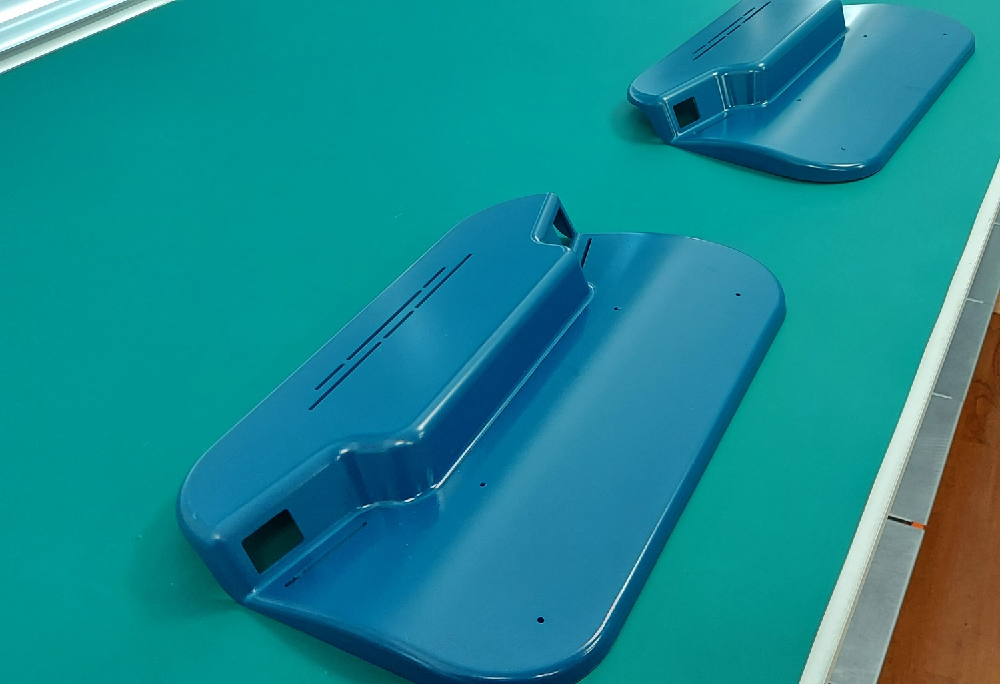
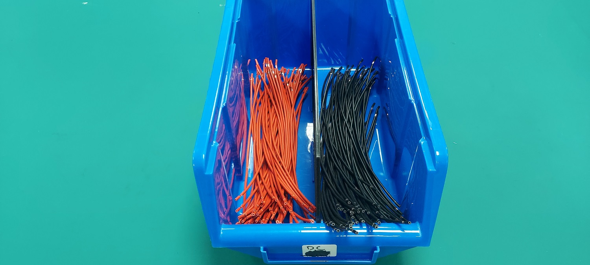
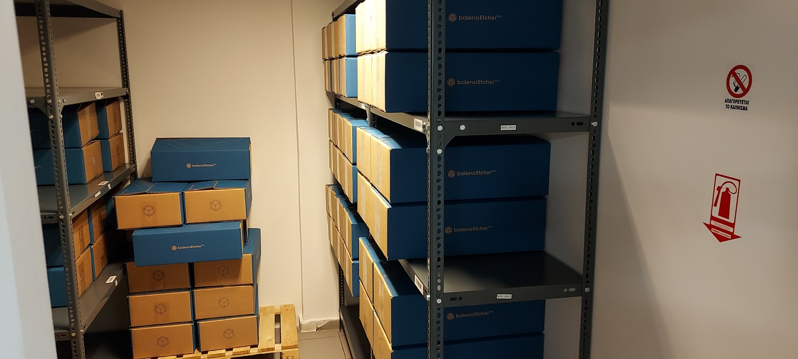

 

# Assembly Batch production
EtcherPro [v1.1.3](https://github.com/balena-io-hardware/etcherPro/tree/v1.1.3)

## Contents

  - [EtcherPro packed](#EtcherPro-packed)
    - [Cable bag subassembly](#Cable-bag-subassembly)
    - [EtcherPro in bag](#EtcherPro-in-bag)
    - [EtcherPro final-testing](#EtcherPro-final-testing)
      - [EtcherPro device](#EtcherPro-device)
        - [Top subassembly](#Top-subassembly)
          - [Top shell complete](#Top-shell-complete)
            - [Top shell with UV resin](#Top-shell-with-UV-resin)
            - [Fan blower complete](#Fan-blower-complete)
            - [Magnets complete](#Magnets-complete)
          - [PCBA complete](#PCBA-complete)
            - [CM subassembly](#CM-subassembly)
            - [DC harness](#DC-harness)
        - [Bottom subassembly](#Bottom-subassembly)
          - [PSU complete](#PSU-complete)
            - [AC harness](#AC-harness)

* General advice in keeping with assembly line regulations: Always keep the production-use blue boxes stocked with parts. While some products are utilized exactly as they were when they were first packaged, other products may require some packaging alterations to make them more accessible.

* Those are the following:

- Maxen 7in screen
- Top and Bottom shells
- heatsinks
- Power cords
- PSUs
- Packaging Foams paddings
- Carton EtcherPro's printed boxes for Packaging

## AC harness

Find the [BoM](https://github.com/balena-io-hardware/etcherPro-assemblyGuide#ac-harness) on the assembly guide.

#### Steps

1. Cut as many 14cm cables (yellow, blue, brown) as specified in the production-manufacturing order by
selecting program 1 on the cable-cutting-stripping machine and put it in the small blue box as shown in the photo.
2. Cut as many 40cm cables (yellow, blue, brown) as specified in the production-manufacturing order by
selecting program 2 on the cable-cutting-stripping machine and put it in the large blue box as shown in the photo.

| Wires | Image |
|-|-|
| Yellow AC wires |  |
| Blue AC wires |  |
| Brown AC wires |  |

* For further instructions follow the [AC-DC wire-cutting-stripping guide](https://github.com/balena-io-hardware/etcherPro-assemblyGuide/blob/master/output/Sub-processes/AC-DC-wire-cutting-stripping.md)
3. Keep the box containing the short wire of one colour of wires on the workbench where the crimping machine is,
to your right, and store the remaining boxes underneath the bench, as indicated in the photo.

4. Place the AC-wire's small box used for the assembly line in your left side as shown in the photo.

5. Bring the small box with the quick terminals to the crimping machine's left side.

6. Start crimping the wires by stripping one of the two sides the length is the same
and each one you complete place them by colour to the box as shown in the photo.

* Tip: Keep a small trash can beside you so you can discard immediately the protecting caps.

* Follow the crimping process instructions [here](https://github.com/balena-io-hardware/etcherPro-assemblyGuide/blob/master/output/Sub-processes/Cable-crimping.md)

7. Repeat the process also for the other colour of the short wires.
8. Place the short wires in the designated location on the production shelf once you have completed using all the colours.
Do not move them unless there is a cause to do so and the warehouse manager is informed of it. The assembly warehouse has a wayfinding map
in the inventory software system.

9. Repeat the same process for the long wires as well.

## Bottom subassembly.

Here is the guide for the [BoM + instructions](https://github.com/balena-io-hardware/etcherPro-assemblyGuide#Bottom-subassembly)

#### Steps

1. Apply 20 Bottom shells across the workbench.

2. Use the file tool to remove any excess plastic between the gaps if any.

3. Apply the metal labels to the whole Batch.
* Tip: After you have finished applying the labels to the whole batch
take the cleaning cotton rag, push them to its place by wiping them off and also remove by any chance fingerprints.
Each time you finish pushing in place the metal label for each shell, turn it over to save time for
the next step.

4. Apply the PSUs to the bottom shells according the guide's instructions. Keep the whole carton PSU's box
in the cart beside you having the carton flaps of the box removed as you can see in the photo below so it's easier and faster to take them
from the box. Discard the carton box-flaps to the trash and keep the cart clean. Return the parts from the previous steps to the assembly warehouse.

5. Apply the entry modules following the assembly guide's [instructions](https://github.com/balena-io-hardware/etcherPro-assemblyGuide#Bottom-subassembly).
6. Apply the AC wires to the PSU. Load the cart with the big and small AC for production boxes.

- Have the big box laying over along the cart's upper layer and the small box in front of it as indicated in the photo.
- Take the Bosch screwdriver with the proper tip. Take out the plastic cover on the AC side of the PSU and keep it aside.
- Take out the protecting cover caps from the wires and leave them beside you on the work bench or straight into the cart.
- Leave the wires straight by having the stripped edge of the sort wire on the left side of the screw and other edge of the longer wire on the right side and then screw them in place.
- Start from the yellow wires '⏚' then move on to the blue 'N' and last to the brown 'L' wire following the same order, make sure that all the wires are properly
secured in its place.
- Apply the edges with the quick terminals to the entry modules by applying first the short and then the long wires.
The preferred and the most efficient order of applying the shortest wires to the right C13 side entry module is:

1st the Yellow

2nd the Blue

3d the Brown cable

Follow the opposite order of applying the longest ones to the C14 left side entry module.

- After you have finished installing the wires put back the AC plastic cover to the PSU and move on to the next one.

- After you have finished the batch discard the wire caps from the work bench or from the cart.   

## DC harness

####Steps

* For further instructions follow the [AC-DC wire-cutting-stripping guide](https://github.com/balena-io-hardware/etcherPro-assemblyGuide/blob/master/output/Sub-processes/AC-DC-wire-cutting-stripping.md)

* Follow the crimping process instructions [here](https://github.com/balena-io-hardware/etcherPro-assemblyGuide/blob/master/output/Sub-processes/Cable-crimping.md)

1. Cut as many 27cm DC wires as specified in the production-manufacturing order by
selecting program 3 on the cable-cutting-stripping machine and put it in the small blue box as shown in the photo.

- *Note* The cables should be kept with the 9mm side at the back and the 7mm side in front of the box as indicated in the photo.

2. Keep the box containing the DC wires to your right side of the crimping machine on the workbench.

Bring over the production box and keep it to your left.

Bring the small box containing the quick terminals and keep it to the left side of the crimping machine on the work bench.

3. Start crimping using the fork terminals by stripping the 7mm side of the wires.
Each one you complete place them by colour to the box as shown in the photo.

4. After you have finished store the box to the dedicated production shelf.

## CM sub-assembly guide

#### Steps

Here is the [BoM- instructions.](https://github.com/balena-io-hardware/etcherPro-assemblyGuide#CM-subassembly)

1. Fill the cart with the all the appropriate tools and parts for the CM sub-assembly following the BOM
2. Fill the cart with the carton box with the CMs and spread them across the assembly line's workbench next to each other

3. Apply the thermal paste according the instructions to the CPU
4. Bring back to the assembly warehouse the CMs and place them to the dedicated shelf
5. Add to the cart the heatsinks and the antennas by keeping them on the second level of the cart
6. Add the Heatsinks to the whole batch of the CMs following the orientation on the assembly guide
7. Screw them in place
- Push the components you were using a little bit back but don't yet return them to the storage shelf.
8. Bring the antennas up and start adding them to the CMs
9. Install the clips
10. Start flashing the CMs by adding the in batches to the Flashing board according the instructions of the main assembly guide.
- Put them to the CM position and lock them up.

  

11. Keep them in storage after the flashing has finished and return everything back to its place. Use the same cardboard box that contains the CMs.

## PCBA complete

#### Steps

Follow the assembly guide [here](https://github.com/balena-io-hardware/etcherPro-assemblyGuide#PCBA-complete)

1. Take the entire box containing the mainboards from the storage shelf in the assembly warehouse and place it in the cart
2. Apply the mainboards across the main assembly workbench, 20 is the maximum capacity.
- Orient the mainboard so that the header connectors pointing upwards
- The mainboards are often wrapped in bubble wrap and protective foam.

- Apply each mainboard across the workbench it can hold a maximum of 20 PCs. Remove the packing off each mainboard, place it on the work surface, retain it in the carton box with the mainboards and discard it when you're finished.

- *Tip* : Keep the carton box containing the mainboards on the bench behind them rather than returning it right away to its storage shelf so you can use it again if you need to assemble more than 20 pieces without causing the assembly line to stall. Do the same for the card readers.
Return them back in the warehouse after you are done.

  

3. Remove excess plastic parts from the mainboard using the pliers, if any. Keep them on the bench and discard them after you are done.
- Mainboards shouldn't be placed on the bench edge, instead, allow around 20 cm of space below them so that you have enough to spread out the card readers.
 Return the rest of the mainboards if any to the assembly warehouse.
4. Load the cart with the card readers from the assembly warehouse, keep the pliers plus a knife on the cart.
- Card readers are typically bubble wrapped, to remove the bubble wrap, cut the tape around them using a knife.
- Place the first group of card readers beneath the first mainboard, then start unwrapping.

  

- Take the first group of ten when they are exposed and use the pliers to separate them from the extra plastic.

    

Use **extreme caution** when detaching the readers from the plastic columns holding them together by using the pliers' tip. Apply as much pressure as necessary to multiple spots on the columns to enable safe, easy breaking.  

- Leave 8 pairs underneath each mainboard since they are typically combined in pairs of two.
There are sixteen slots on each mainboard.
- Continue unwrapping the packet to expose the next batch of ten. Keep pushing the bubble wrap at the side from your right hand unrolling at the same time.
- Take the next bubble wrap batch and continue the process.
- Until the process is finished, leave the bubble wrap garbage on the upper side of the bench. Discard after the process is finished.

   

5. Using the necessary force, carefully separate each pair when you grasp them in your hands from the opposite side where the pins are.

   

One by one, insert them into the mainboard's slots.
- When you use force to assemble them, hold it from the USB slot
and not from where the LED is because there is a possibility to come off.
- Make sure that all the pins are properly inserted.
- Make sure that the small peg that the card readers have should also fit in respective mainboard hole.
6. Keep the bench free of anything that has to be thrown away and move on to the next step.
7. Fill the cart with the 20mm stand-offs and take the BOSCH screwdriver with the 5mm HEX socket driver and install them to the mainboards according the instructions of the assembly guide above.
- Follow the appropriate settings for BOSCH screwdrivers following the instructions of the assembly guide above.
- Note: You should **ALWAYS** check the speed and torque to be at the recommended settings before using any of the screwdrivers.  
- Return the standoffs back to the assembly warehouse
8. Load the cart with the DC harness.
- Return in the assembly line
- Grab the screwdriver with the double ended bit.
- Begin installing the cables by colour, following the assembly guides' instructions above.
- Keep the cart at you right hand side and move along as you finish each mainboard.
- Return the rest of the batch back to the assembly warehouse.
9. Load the cart with the CM sub-assemblies and bring them over to the assembly line.
- Begin the installation according the instructions of the assembly guide.  
- When you are done return everything back to the warehouse, discard the trash.

  

**Important notes**
- Usually both of the steps explained below are taking place at the same time and we will explain how is this possible.
- After you have applied the mainboards across the bench and the excess plastics are being removed, you begin assemble the CM sub-assemblies.
- Start by flashing the initial batch of CM sub-assemblies, and while doing so, start adding the card readers to the mainboards.
- Continue installing the card readers once you have set the flashed CMs aside on the bench of the second row and prepared the following batch for flashing. Continue in this manner until all CM sub-assemblies have been flashed and all card readers have been installed.
- Install the CM sub-assemblies to the mainboards after flashing is complete.
- Follow the instructions in the CM sub-assembly guidelines as a stand-alone process if you don't have mainboards to test and assemble, this process is only relevant when you have mainboards to test and assemble.

**- The mainboards need to be tested before installing them to the main device.**

## PCBA Testing

#### steps

1. Apply the QR-code stickers to every mainboard.
- The P-touch editor must be installed on your PC and the template you will be using it will be provided to you.
- The printed sticker has the mainboards' *LOT number-the Part number-and the SN* which in this case is just a physical number provided from the supplier that all mainboards have on them.
- Print the stickers, each time changing only the number (SN) to the description and the QR code inside to correspond to the numbers you currently have on the batch of mainboards you are testing.
- Add the sticker on the top left corner of the backside of each mainboard.
- **Caution** Only after sticking the QR-code sticker to the mainboards should you remove the sticker with the number otherwise, it will get mixed up, making it impossible to document the history of this mainboard.

   

- Proceed to the testing process.
2. Bring over the test beds to the testing bench.

  

- Plug in the power cords that are in the backside of the bench

  

- Place the mainboard subassemblies(PCBA complete) to the testing beds having the slots facing
the 3d printed columns.

  

3. Screw the mainboards in place using the 20mm standoffs column.

  

- Make sure it's well screwed in place.

  

4. Turn on the power switches to give power to the test beds.

  

5. You will see the Etcher UI after 1min and 35-45 sec.

  

6. Make an inspection of the screens' functionality by tapping the settings menu and the WiFi logo, both of them should be responsive.
7. At this point, all LEDs should be turned off. Try a power cycle if any are on. If the problem still exists, try plugging in the card reader next to it which at this point the LED is off and if the LED illuminates, have a sticky note on the mainboard providing the issue and leave this mainboard aside.
- Add a new card reader there if the card reader's LED isn't illuminated.
8. Plug in the first 16 interfaces (SD, MSD, USB) in a row, starting with the source interface ( the first from your left side by looking the mainboard). It doesn't matter which drive-interface you will test first. The source interface will have a Source label on it.
- Plug in the rest of the interfaces to the next 2 mainboards.
- All the slots should have a white LED and 16 targets recognized.
- If you have 15 targets and a LED off reconnect this interface to the card redear which the LED is off, if the issue persists take out the card reader and try to reconnect it making sure that the pins are secured properly. If still isn't recognizable connect the card reader next to it, if it's recognized replace the card reader with a new one and leave the faulty one aside for repair.
- If functional card reader you used isn't recognizable either then it's a mainboard issue. Have a sticky note explaining the issue and take this mainboard to the dedicated for troubleshooting shelf after the batch is finished.
- If you have 16 targets recognized but 15 white LEDs on try reconnecting the interface, if the issue persists try reconnecting the card reader with the LED off, making sure that the pins are properly connected, if still the issue remains replace the card reader with a new one.
- If you have a different colour for any of the slots replace the card reader with the different colour.
9. Begin the speed test.
- Choose flash from file and then select or double tap the Ubuntu file.
- A Blue LED should appear in the first slot which is the source drive and 15 targets ready to be flashed. Press flash.
- During flashing 15 purple LEDs will blink while the blue LED remains steady. If not and a LED has a different colour, press cancel and replace the card reader with a new one. Repeat the process for this mainboard.
- During validation 15 green LEDs will blink while the blue LED remains steady. If not and a LED has a different colour, press cancel and replace the card reader with a new one. Repeat the process for this mainboard. Have this card reader aside for repair having a sticky note explaining the issue.
- If you have a red LED on you will see a notification in the device's screen that this target failed the test, repeat the steps for this mainboard. Replace the card reader with a new one if the problem persists. If it keeps failing, consider using a different card reader because sometimes even the brand-new card reader you are testing has problems. Put a sticky note on this mainboard and set it aside for repair if the issue still persists.
- The test should be considered successful when the flashing is complete and the average speed of each interface hits 45MB/s or above.
10. Put a sticky note on each test bed so you can keep track of which interface you tested on each one and remember it.
- Verify that you can easily extract the interfaces from every slot, especially on MSD interfaces, and that none of the slots are stuck.
11. Repeat the whole process for each mainboard you have in the batch for every interface(SD,MSD,USB)

**Important notes**
- Move every faulty mainboard and card reader to their shelves for repair **ONLY** after you have finished the whole batch to save time and be faster.
- Don't forget to note down the failed to pass the test mainboards as long as the issue that they have. The same applies for the card readers.
- Place the card readers to a nylon bag along with a sticky note explaining their issue and the LOT number.

## Magnets complete

#### Steps

- For further information follow the [guide](https://github.com/balena-io-hardware/etcherPro-assemblyGuide#Magnets-complete)

1. Transfer the box with the magnets into the assembly line
- Take the 3M adhesive tape placed on the second row bench. If not refill from the dedicated shelf on the assembly warehouse
- Apply the 3M adhesive tape to a whole magnet row
- Do this as many times as required.
2. Separate 1 piece of magnet using the knife only during installation to the Top-shells' front pegs.
- Use the tweezers to remove the protective film.
3. Return the whole batch of this sub-assembly to the assembly warehouse

## Fan blower complete

#### Steps

- For further installation info follow the [guide](https://github.com/balena-io-hardware/etcherPro-assemblyGuide#Fan-blower-complete)

1. Take the whole batch of the fan blowers to the assembly line and begin adding the double-sided foam paddings on the back side of the fan.
- After you are done place the fan back to the plastic box as it is without removing the protective film. Do this for every fan in the batch.
- After finishing, return the plastic box containing the fans' sub-assembly parts to its original location.

   

## Top shell with UV Resin

#### Steps

- For further installation info follow the [guide](https://github.com/balena-io-hardware/etcherPro-assemblyGuide#Top-shell-with-UV-resin)

1. Place the top shells side by side on the workbench as defined by the manufacturing order, 60 is the max capacity, 3 rows of 20.
- Place them upside and inspect them according the guide.
2. Load both of the carts with the top shells, up to a maximum of 6 to each cart.
- It makes little difference which side of the bench you begin taking shells from first, but after you've made a choice, stay with it to cut down on confusion and speed.
- Be extra careful on how you are loading the cart to avoid damaging or scratching the top shells.
- Each tier of the cart should have the top shells halfway in. Each of the cart's 3 levels may accommodate a pair of shells.
- Bring them where the UV curing station is and place the seat between them.
- To avoid delays, make sure you have enough of the supplies you'll need nearby, such as syringes and needles.
3. Begin taking a shell from your left or your right side it doesn't make any difference.
- Although choose the side from which you will always start picking the shells till the ending of the batch of each cart to maximize speed. If not, you will constantly pause to determine which shells have been completed and which have not.

   

4. Load the syringe with the resin and remove the excess air according the guide instructions above.
- Be extra careful of the amount of resin you fill the syringe off. Always go for the smaller quantity because it cures quickly when exposed to light of any kind, natural or artificial. 3-4 ml
 will be enough for the 12 shells round. If it cures dispose of it and use a new one.
5. After the resin is being applied to all sixteen holes place the top shell halfway through to the curing station making sure that both LED lamps are pointing to the LED holes.
- Begin applying the resin to the next shell while the previous one is curing.
6. The shell that is curing would have been dried by the time you finished filling the holes with resin to the other one.
- Adjust it on the cart before adding the upcoming ones for curing and filling. When one cart is full with the cured ones, go on to the next one.  
7. Put the top shells back on the bench once you have finished both carts, and be sure to use a pointer, such as a pencil or pen for example, to help you tell between the cured and uncured shells.
8. After you are finished the batch leave them on the bench so you can go to the next step.

## Top shell complete

#### steps

- For further installation instructions info follow the:
- [Guide 1](https://github.com/balena-io-hardware/etcherPro-assemblyGuide#Top-shell-complete)
- [Guide 2](https://github.com/balena-io-hardware/etcherPro-assemblyGuide#Top-subassembly)
1.  Place the top shells side by side, 20 is the maximum capacity of the workbench.

2. Bring a whole sheet of the logo stickers over, and keep the tweezers close by, start adding the stickers.

  

- For further installation steps follow the **Guide 2** instructions

3. Load the cart with a whole carton box of screens with the carton flaps removed. Have the tweezers on the workbench beside you.

  

- Install the screens according the **Guide 1** instructions.
- After placing the screens into position and ensuring that all four corners are properly glued, keep the shells upside down and parallel following the guides' instructions.

4.  Fill the cart with the M3x8mm HEX male-to-female self-threading standoffs plus the magnet sub-assembly and take the **BOSCH GSR12V screwdriver** along with the Stand-off alignment jig (HT1).
- Add the standoffs to every shell.
- Have a full row of the magnet sub-assembly underneath the top shell you are working on in front of you on the bench.
- Separate each piece using the lancet according to the **Guide 1** above and finish every shell

5. In the assembly warehouse, unload the cart of parts you won't be using, then reload it with the fan subassemblies.

- Place the fan jig in front of you on the workbench and the entire package containing the fans and the tweezers, on the cart.
- Align the fan to the top shells' left side and add the fan. Repeat the process for every shell.
Use the tweezers to remove the protection film of the adhesive tape.
- Have the batch underneath the workbench and easier access when it's time to assemble EP complete devices. Storage the rest to the main warehouse if any.

## Top sub-assembly

#### Steps

- For further installation instructions info follow the [Guide](https://github.com/balena-io-hardware/etcherPro-assemblyGuide#Top-subassembly)

1.  Place the complete top shells on the workbench upside down with the slots facing the other direction from you.

  

- Place the top shells on the top side of the workbench.
2. Load the cart the mainboard subassembly from the dedicated shelf.

  

- Place each mainboard sub-assembly under each top shell.

  

3. Add the mainboards to the top shells carefully.

   

- Before you make the attachment, check to see that the card readers are properly positioned within the top shell's slots.
4. Load the cart with the 8mm and the 10mm standoffs and secure the mainboards to the top shell.
- Have a **BOSCH screwdriver** next to you.
- Add the 8mm standoffs first, going all the way across the workbench, and then add the 10mm standoffs, going the other way.

   

- If there is any extra film under the 20mm standoffs' holes, throw it away.

  

5. Take the tweezers and start adding the screens' films.
- Connect the fan's connector as well. Make sure you remove any excess bubble wrap protection film from the connector before you attach the fan if any.

  

6. Attach the 2 antennas to the top shell.

   
   

- For all the previous steps follow the **Guides'** instructions above.

## EtcherPro device

####Steps

- For further installation instructions info follow the [Guide](https://github.com/balena-io-hardware/etcherPro-assemblyGuide#EtcherPro-device)

1. Across the workbench, place the top sub-assemblies about in the middle and across of it.

  

- Make always sure that the bench is clean.

2. Place the bottom sub-assemblies directly beneath and close to them.

  

3. Take the **BOSCH GSR12V screwdriver** make sure it's set on *speed 1* *torque 1*
4. Connect the two of them.

  

5. Each top-shell should have a sticker on it with their mainboards' number plate.

  

6. Don't yet connect the 2 shells so you can go to the next step which is the final testing before packing.

## EtcherPro final-Testing

#### Steps

1. Transfer 10 devices side by side to the workbench being in the 2nd row dedicated for testing.
- Have their screens facing towards the assembly workbench.

  

2. Power cords are fastened to the workbench in their backside. Power on the batch of the ten devices.
- It will take about 1min and 35-45sec for the device to boot( be at the EtcherPro UI)
- Make sure that the WiFi it's on. It appears on the screens' top left corner.

  

- Make an inspection of the screens' functionality by tapping the settings menu and the WiFi logo,
both of them should be responsive.
- Every LED should be off at this point. If any are on, try a power cycle. If the issue persists, set aside this device for debugging and move on to the next.
- Have your Laptop next to you and make sure that the devices appears in the EP production fleet.

   

    
  

- Every device will be identifiable by its UUID, which will appear in the settings menu and be the same in the balena cloud as well.

   

    
  

- To find the most recent devices, click the *Created on* link. By selecting the most recent device that have been built, you may view its serial number on the devices' dashboard and tag the following ascending SN to each of the other dashboards of the devices to the fleet on the batch you are working on.
- Leave a note in the dashboard's note field of each device with the mainboards' number.
- Tip: Before you tag the most recent SN, perform a search to make sure you don't have any duplicates.

   
 

  

- After you are done tagging the Serial numbers proceed to the speed testing.
3. Plug in the first 16 interfaces (SD, MSD, USB) in a row, starting with the source interface ( the first from your left side by looking the device). It doesn't matter which drive-interface you will test first. The source interface will have a **Source** label on it.

   

  

- Plug in the rest of the interfaces to the next 2 devices.
- All the slots should have a white LED and 16 targets recognized.
- If you have 15 targets and a LED off reconnect this interface, if the issue persists leave the device aside for debugging.
- If you have 16 targets recognized but 15 white LEDs on try reconnecting the interface, if the issue persists leave it aside for debugging.  
- If you have a different colour for any of the slots keep it aside for debugging.

  

- Choose flash from file and then select or double tap the Ubuntu file.

 
  

- A Blue LED should appear in the first slot which is the source drive and 15 targets ready to be flashed. Press flash.

  

- During flashing 15 purple LEDs will blink while the blue LED remains steady. If not and a LED has a different colour, set it aside for debugging after flashing.
- During validation 15 green LEDs will blink while the blue LED remains steady. If not and a LED has a different colour, set it aside for debugging after flashing.
- If you have a red LED on you will see a notification in the device's screen that this target failed the test, repeat the process for this device if the issue remains leave it aside for debugging.
- When the flashing is finished and the average speed of each interface reaches 45MB/s or more, the test should be considered successful.
4. Put a sticky note on each device so you can keep track of which interface you tested on each one and remember it.

 
  

- Verify that you can easily extract the interfaces from every slot, especially on MSD interfaces, and that none of the slots are stuck.
5. After you have tested every interface to every slot of each device successfully, seal the devices.
- Take the box with the M3x8mm torx countersunk screws (Screw shell) and secure the top with the bottom shell according the [Guides'](https://github.com/balena-io-hardware/etcherPro-assemblyGuide#EtcherPro-device) instructions.
6. Take the devices to the packaging workbench.
7. Repeat the testing process to the next batch of ten.

## EtcherPro in bag

## Steps

- For further installation instructions info follow the [guide](https://github.com/balena-io-hardware/etcherPro-assemblyGuide#EtcherPro-in-bag)

1. Place the complete devices side by side on the second row's bench. 20 is the maximum capacity
- Use the production bench as well, 20 devices can be placed side by side on it.
2. Start wiping off the devices and cleaning them of any fingerprints or other smudges while wearing the rubber gloves.
- Do not remove the screen's protective film as you wiping them off.
3. Take the small box with the *Getting started* sticker and add it to the top right screen's corner.
- Use the tweezers to remove the protective film of the sticker's back side.
- Have the sticker diagonally.
- If the screen's protective film is scratched or it has bubbles remove it and add the sticker
to the same place on to the packing bag afterwards.
4. Load the cart with a pack of the packing bags and begin putting the devices inside. Fold the bag towards the bottom.

 
  

## Cable bag subassembly

#### steps

1. The cable bag contains every adapter along withy the power cord inside.
- Bring a whole box containing the cable bags to the assembly line.
- Add the stickers inside the bag according the [guide](https://github.com/balena-io-hardware/etcherPro-assemblyGuide#Cable-bag-subassembly)
- There is a dedicated carton box on the packaging bench inside the assembly line.
- Place the complete subassembly in.
2. After you have finished place the whole box underneath the packaging bench and leave it there.

## EtcherPro packed

#### Steps

- For further installation instructions info follow the [guide](https://github.com/balena-io-hardware/etcherPro-assemblyGuide#EtcherPro-packed)

1. Bring a whole carton box of the packing foams inside the assembly line.
- Start putting the foams on the device's sides keeping the box with the foams next to you.
2. Bring over a pack of carton printed boxes into the assembly line.
- Once you've assembled 10 carton-printed boxes, arrange them across the packing table with the logo facing away from the testing bench.
3. Add in the carton boxes the cable bag subassembly with the balena logo facing upwards.

 
  

4. Add the EtcherPro device with the balena logo set so that it is aligned with the logo on the carton box.

5. Seal the carton boxes and take them to the dispatch room.

  
  

6. Repeat the process for the remaining devices per batch of ten each time.  
